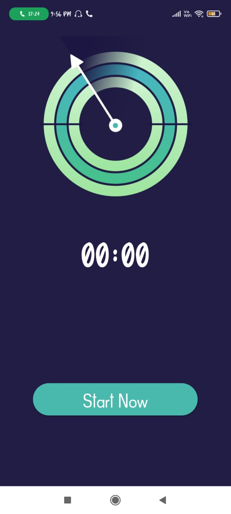
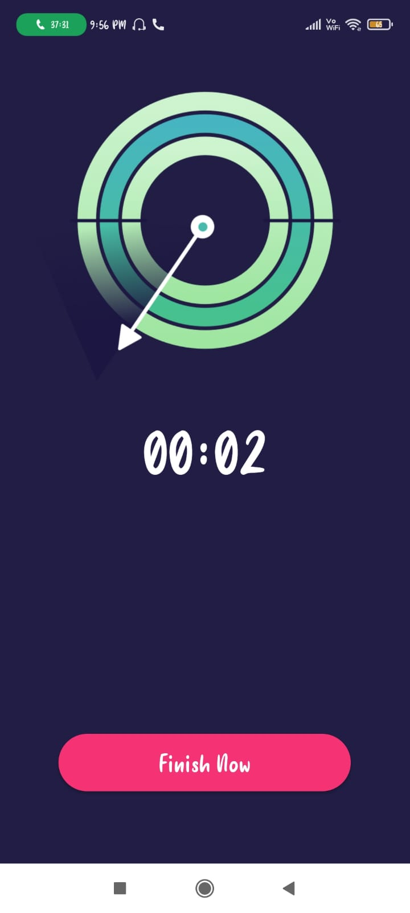

# STOP-WATCH-ANDROID-APP :star_struck: 

[](https://shields.io/) [](https://shields.io/) [](https://shields.io/) [](https://shields.io/) [](https://shields.io/) [](https://shields.io/) [](https://shields.io/) [](https://shields.io/) 

***This new android application named 'STOP-WATCH-ANDROID-APP' is created by Biswarup Bhattacharjee, student of BTECH, in University of Engineering and Management, Kolkata.***

**Email Id: bbiswa471@gmail.com.** 

**Contact No: 916290272740.** 

<p align="left">
<a href="https://www.facebook.com/profile.php?id=100070395300810" target="blank"></a>
<a href="https://instagram.com/biswarup2210" target="blank"></a>
<a href="https://github.com/biswa2210/biswa2210" target="blank"></a>
</p>

## What is StopWatch :point_down: 

<div align="justified">
 
A stopwatch is a timepiece designed to measure the amount of time that elapses between its activation and deactivation.A large digital version of a stopwatch designed for viewing at a distance, as in a sports stadium, is called a stop clock. In manual timing, the clock is started and stopped by a person pressing a button. In fully automatic time, both starting and stopping are triggered automatically, by sensors. The timing functions are traditionally controlled by two buttons on the case. Pressing the top button starts the timer running, and pressing the button a second time stops it, leaving the elapsed time displayed. A press of the second button then resets the stopwatch to zero. The second button is also used to record split times or lap times. When the split time button is pressed while the watch is running it allows the elapsed time to that point to be read, but the watch mechanism continues running to record total elapsed time. Pressing the split button a second time allows the watch to resume display of total time.

</div>

## About :point_down: 

<div align="justified">
 
This is a simple stopwatch android application created using java. Here when we open the app we have to click on 'GET STARTED'. Then we can see a timer at 00.00. If we click on 'START NOW' then the timer will be started. If we click on 'FINISH NOW' then the timer will be stopped. This is a very user friendly stopwatch. It can be used for multiple types of task as per user's need.

</div>

## STOP WATCH DEMO VIDEO: :point_right: <a href="https://www.youtube.com/watch?v=fgxUX_dkf8s&list=PL0lbDlMJ1h4hiR-xQJTPRijsOF1-0hhAG&index=2&t=2s">Click here to watch</a>

## ANDROID PLAYLIST: :point_right: <a href="https://www.youtube.com/watch?v=Jfq38C1hKXs&list=PL0lbDlMJ1h4hiR-xQJTPRijsOF1-0hhAG">Click here to watch</a>

## APP DOWNLOAD LINK : :point_right: <a href="https://drive.google.com/file/d/1pogbiexC2r4se14qlqbbaxkgMSs73WYw/view" download>Click here to download</a>

## Purpose :point_down:

<div align="justified">
       
I have made stopwatch android application for measuring time for any purpose. Stopwatches and timers are instruments used to measure time interval, which is defined as the elapsed time between two events.
</div>
       
## Importance :point_down:

<div align="justified">

The device is used when time periods need to be measured precisely and with minimum complications. Laboratory experiments and sports events like sprints are classic examples of its application. The stopwatch function is also present in many electronic devices such as wristwatches, computers, cell phones, and portable music players. Digital electronic stopwatches are far more accurate timepieces than mechanical because of their crystal oscillator timing element. Measures elapsed time much more accurately than is possible with the help of pressing the buttons. Helps recording date and time-of-day functions with the presence of an inbuilt microchip. External sensors allow the stopwatch to be stimulated by external events.
       
</div>

## Folder Structure :point_down:
```bash
stop-watch-android-app
      └── app
           └── src
                └── main
                      └── java/com/example/stopwatch
                                     ├── MainActivity.java
                                     └── Stopwatch.java   
 ```                      
## Making :point_down:

<div align="justified">

I have created main 3 java files to create this android app. I have created MainActivity.java, Stopwatch.java and created some logics for implementation of this app. 
 
</div>


## Screenshots :point_down: 

<div align="center">
  
<a href="pics/sw.jpeg"></a> <a href="pics/sw1.jpeg"></a> <a href="pics/sw2.jpeg"></a>
       
</div>


